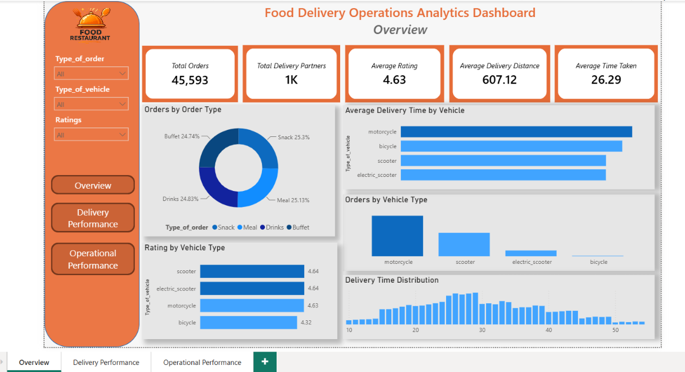
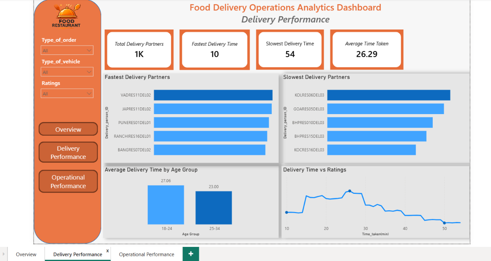
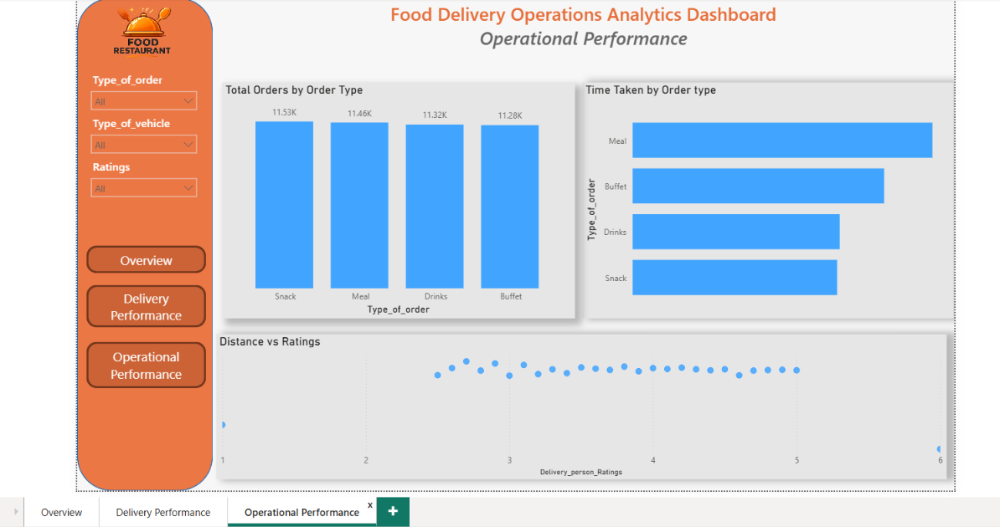

#  Food Delivery Operations Analytics Dashboard

<p align="center">


</p>

---

#  Project Overview

Food delivery services rely on efficient logistics to ensure timely deliveries and maintain customer satisfaction. This project analyzes food delivery operations using **SQL** and **Power BI** to evaluate delivery performance, identify operational patterns, and generate actionable business insights.

The project follows an end-to-end analytics workflow including data cleaning, exploratory data analysis, business-focused SQL queries, KPI development, DAX measures, and interactive dashboard creation.

---

#  Business Objective

The objective of this project is to:

- Analyze delivery operations and performance.
- Measure delivery efficiency across different vehicle and order types.
- Evaluate delivery partner performance.
- Identify operational patterns affecting delivery time.
- Build an interactive dashboard for business decision-making.

---

#  Tech Stack

| Tool | Purpose |
|------|---------|
| MySQL | Data Cleaning & Analysis |
| Power BI | Dashboard Development |
| Power Query | Data Transformation |
| DAX | KPI & Business Measures |
| Microsoft Excel | Data Source |

---

# Dashboard Pages

## 📈 Executive Overview

Provides a high-level summary of delivery operations.

### KPIs

- Total Orders
- Total Delivery Partners
- Average Delivery Rating
- Average Delivery Time

### Visualizations

- Orders by Order Type
- Orders by Vehicle Type
- Average Rating by Vehicle
- Average Delivery Time by Vehicle
- Delivery Time Distribution

---

##  Delivery Performance

Analyzes delivery partner efficiency and performance.

### KPIs

- Fastest Delivery Time
- Slowest Delivery Time
- Average Delivery Time

### Visualizations

- Fastest Delivery Partners
- Slowest Delivery Partners
- Delivery Time by Age Group
- Delivery Time vs Rating

---

## Operational Insights

Provides business insights into delivery operations.

### Visualizations

- Vehicle Performance
- Order Type Performance
- Rating Analysis
- Delivery Time Analysis
---

#  SQL Workflow

The SQL project consists of three major phases.

## 1️⃣ Data Cleaning

- Checked duplicate records
- Handled missing values
- Renamed columns
- Removed unnecessary spaces
- Standardized column names
- Validated data quality

---

## 2️⃣ Exploratory Data Analysis

Performed exploratory analysis to understand the dataset.

Examples include:

- Total Orders
- Average Delivery Time
- Delivery Partner Count
- Vehicle Distribution
- Order Type Distribution
- Rating Distribution

---

## 3️⃣ Business Analysis

Business-driven SQL queries were written to answer operational questions.

Examples include:

- Which vehicle type delivers the fastest?
- Which delivery partners perform best?
- Which order type requires the longest delivery time?
- Does delivery rating impact delivery performance?
- Which age group performs better?

---

#  Key Insights

- Motorcycles handled the highest number of deliveries.
- Snack orders represented the largest share of total orders.
- Higher-rated delivery partners generally completed deliveries faster.
- Delivery time varied across different vehicle types.
---

#  Dashboard Preview

## Executive Overview




---

## Delivery Performance




---

## Operational Performance



---

#  Repository Structure

```
Food-Delivery-Operations-Analytics
│
├── Dataset
│   └── Food_delivery_time_data.xlsx
│
├── SQL
│   ├── Data_Cleaning.sql
│   ├── EDA_Analysis.sql
│   └── Business_analysis.sql
│
│
├── Dashboard Preview
│   ├── Food_Delivery_dashboard.pbix
│   ├── Overview.png
|   ├── Delivery.png
│   └── Operational.png
|   
├── README.md
│
└── LICENSE
```

---

# 💡 Skills Demonstrated

- SQL
- Data Cleaning
- Exploratory Data Analysis (EDA)
- Business Analysis
- Data Modeling
- Power Query
- DAX
- KPI Development
- Dashboard Design
- Data Visualization
- Business Intelligence
- Analytical Thinking

---

#  Business Value

The dashboard enables stakeholders to:

- Monitor delivery performance.
- Evaluate delivery partner efficiency.
- Compare vehicle performance.
- Analyze order patterns.
- Support operational decision-making through interactive visualizations.

---


## ⭐ If you found this project helpful, consider giving it a Star!

```
Made with ❤️ using SQL, Power BI, Power Query & DAX.
```
